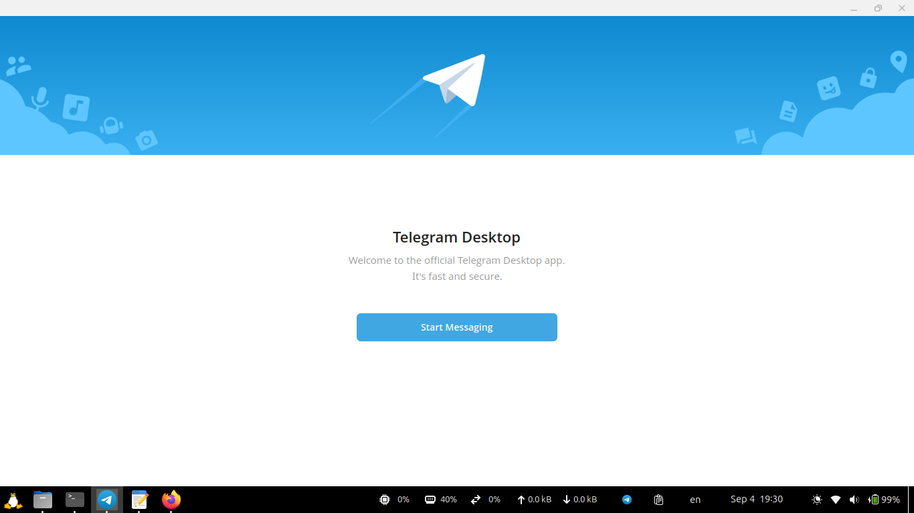

# Telegram Install Properly for Linux

## Telegram App Version: 
[Written in the release script](./making_release_zip.sh)

## Some Information about This:

Download from official website- https://desktop.telegram.org/

I make this repo so that i can run a script and it will install the telegram in my laptop and then it will also be available in the proper location and easy to use and access.

## Making the release

`
./making_release_zip.sh
`

